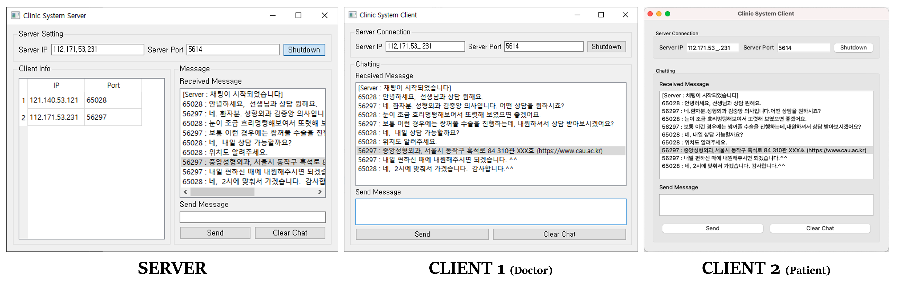

# UC-1-Clinic-System
Repository for Team A's subprogram, Clinic System

## Requirement
- Windows, MacOS or Linux (Ubuntu recommended)
- Python 3 (We tested in conda, but not necessary)
  - PyQt5


## Overview


## Installation
The package requires python3. You can follow the direction below to install virtual environment within the repository or install anaconda for python 3.
- Download the repository

```
git clone https://github.com/CAU-SE-Project/UC-1-Clinic-System
```

### Using Anaconda
- Setup the anaconda virtual environment and installing requirements

```
cd UC-1-Clinic-System
conda create -n clinic_system python=3.6
conda activate clinic_system
pip install PyQt5
```

## Run Demo
### Run Server
Before two or more users run each clients, the server for chatting must be run. You can easily run your server for specific port with direction below.
```
cd Server
python main.py
```
### Run Client
After you run your server, each user can connect their client for chatting. You can easily run your client for specific server's IP & port with direction below.
```
cd Client
python main.py
```
